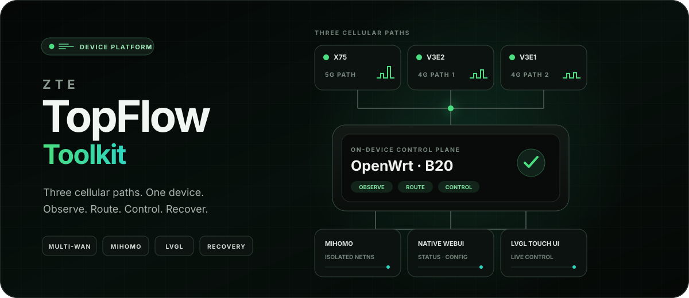
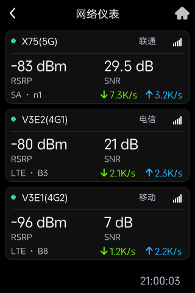
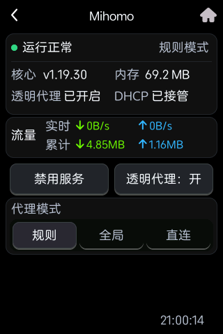
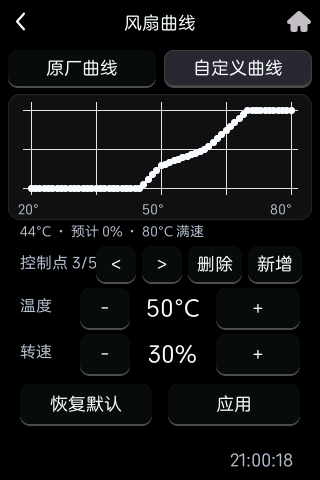

<p align="center">
  
</p>

<p align="center">
  <strong>把一台三路蜂窝随身路由器，改造成可观测、可控制、可回退的边缘网络平台。</strong>
</p>

<p align="center">
  <a href="https://github.com/imshuhao/topflow-toolkit/actions/workflows/ci.yml"></a>
  
  
  <a href="LICENSE"></a>
</p>

<p align="center">
  <a href="#它能做什么">能力</a> ·
  <a href="#实机界面">实机界面</a> ·
  <a href="#开始使用">开始使用</a> ·
  <a href="docs/COMPATIBILITY.md">兼容性</a> ·
  <a href="docs/SCREENSHOTS.md">完整截图</a>
</p>

## 它能做什么

<table>
  <tr>
    <td width="50%" valign="top">
      <strong>蜂窝网络可观测</strong><br><br>
      同时查看 X75、V3E2、V3E1 三路基带的信号、注册、QCI、AMBR、地址、实时流量与趋势。
    </td>
    <td width="50%" valign="top">
      <strong>独立透明网关</strong><br><br>
      Mihomo 运行在独立 network namespace 中；宿主保留原厂路由，DHCP 客户端按需接入 IPv4 透明代理。
    </td>
  </tr>
  <tr>
    <td width="50%" valign="top">
      <strong>双端原生控制</strong><br><br>
      Mihomo 管理能力接入厂商 WebUI；同一套状态与控制延伸到设备原生 LVGL 触摸屏。
    </td>
    <td width="50%" valign="top">
      <strong>设备级运维</strong><br><br>
      覆盖核心与配置更新、散热曲线、Wi-Fi 功率、运行诊断、屏幕抓取、启动恢复与完整卸载。
    </td>
  </tr>
</table>

它不是一个悬浮在设备外面的 Dashboard：网络数据面、Web 管理面和触屏设备面都在同一台 MU5252 上运行，并尽量沿用原厂服务边界。

## 实机界面

以下均为 B20 实机画面，不是设计稿。公开图片已永久遮挡设备身份、号码和网络标识。

<table>
  <tr>
    <td align="center"></td>
    <td align="center"></td>
    <td align="center"></td>
  </tr>
  <tr>
    <td align="center"><sub>三卡网络仪表</sub></td>
    <td align="center"><sub>Mihomo 状态与模式</sub></td>
    <td align="center"><sub>原厂 / 自定义风扇曲线</sub></td>
  </tr>
</table>

<p align="center"><a href="docs/SCREENSHOTS.md"><strong>查看 18 张脱敏实机截图 →</strong></a></p>

## 三层结构

| 层 | 组件 | 职责 |
| --- | --- | --- |
| 网络数据面 | [`mihomo-netns`](mihomo-netns/) | 在隔离 namespace 中运行 Mihomo，提供 IPv4 透明网关、DHCP 网关/DNS 下发和故障恢复 |
| Web 管理面 | [`mihomo-manager`](mihomo-manager/) | 将状态、模式、配置、核心更新和网络开关接入设备原生 WebUI |
| 触屏设备面 | [`touchscreen-control-center`](touchscreen-control-center/) | 通过 `LD_PRELOAD` 扩展原厂 LVGL 界面，集中管理三基带、Mihomo、系统、散热和 Wi-Fi |

这三个组件可以分别阅读和部署。触屏网络页面依赖本机 `zwrt-datad /state`，Mihomo 页面依赖 `mihomo-manager`。

## 设计边界

- **隔离而非替换：** Mihomo 留在独立 namespace，宿主继续负责厂商蜂窝与路由逻辑。
- **可恢复：** 安装脚本保存必要状态，服务停止撤销当前 DHCP 下发，卸载器移除本组件的挂载、服务和规则。
- **固件锁定：** 触屏安装前核对原厂 `zte_topsw_devui` 的 SHA-256；不匹配就停止。
- **不搬运厂商资源：** WebUI 在本地补丁当前文件；仓库不分发 ZTE 二进制、固件、字体或可复用图片资源。

## 开始使用

当前仅验证过以下目标：

| 项目 | 已验证环境 |
| --- | --- |
| 设备 | ZTE TopFlow MU5252 / `MU5252_HW1.0` |
| 固件 | `BD_ENCNMU5252V1.0.0B20` |
| 架构 | AArch64 / musl |

建议按顺序阅读并部署：

1. [部署 Mihomo 透明网关](mihomo-netns/README.md)
2. [安装设备 Web 管理页](mihomo-manager/README.md)
3. [编译和安装触屏控制中心](touchscreen-control-center/README.md)

> [!WARNING]
> 脚本会以 root 权限修改 network namespace、DHCP、init 服务、`rc.local` 和只读 WebUI 的 bind mount。它们不是通用 OpenWrt 软件包，也没有在其他硬件或固件上验证。开始前请准备 root ADB、当前配置备份，以及不依赖被改 DHCP 路径的恢复入口。

更精确的前置条件与固件边界见 [Compatibility boundary](docs/COMPATIBILITY.md)。

## 本地验证

```sh
make check
```

该命令检查 Shell/Node 语法、单元测试和触屏注入库的严格宿主编译。面向设备的正式产物仍应使用 AArch64 musl 交叉编译器构建。

namespace、管理后端和触屏主体来自已经在 B20 实机运行的版本；公开安装器也经过语法、单元测试、严格编译、AArch64 musl 构建和当前设备 Web 文件的只读补丁测试。尚未在另一台干净设备上重跑完整的安装—重启—卸载流程，因此首次部署仍应按实验性改机处理。

<details>
<summary><strong>仓库不包含什么</strong></summary>

- 订阅地址、代理节点、控制器密钥或真实 `config.yaml`；
- 设备抓取、日志、Cookie、序列号或配置备份；
- ZTE 固件、二进制、共享库、字体、可复用原厂图片资源或完整 WebUI 文件；
- Mihomo、Zashboard、GeoIP/GeoSite 或第三方规则缓存。

安装者需自行从各上游获取相关组件并遵守其许可证。文档中的脱敏实机截图只用于展示功能，不作为可复用固件素材。
</details>

## 安全与许可

敏感信息报告方式见 [Security policy](SECURITY.md)。原创代码采用 [MIT License](LICENSE)；第三方项目和设备固件仍受各自许可证约束。

本项目不是 ZTE、Mihomo 或任何运营商的官方项目。
