# 触屏控制中心实机截图

以下画面于 2026-08-29 从一台运行 B20 固件的 MU5252 实机只读抓取。实时数值只代表
抓取时状态，不是示例配置或固定默认值。

公开图片使用不透明遮挡永久移除了号码、ICCID、IMSI、IMEI、模块序列号、IP、DNS、
信道、PCI、PLMN 和小区标识。仓库不包含未遮挡原图。

## 入口与网络概览

| 控制中心 | 三卡网络概览 |
| --- | --- |
| 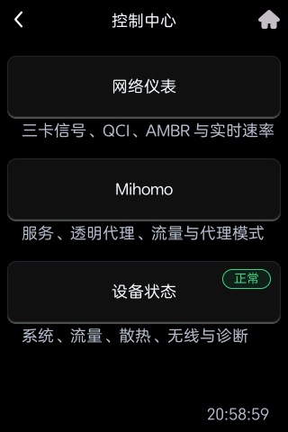 |  |

## 蜂窝网络详情

| X75 无线参数 | X75 网络与承载 |
| --- | --- |
| 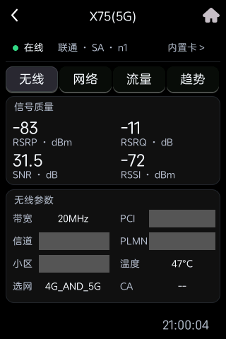 | 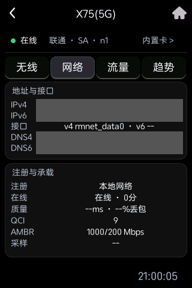 |

| X75 流量 | X75 趋势 |
| --- | --- |
| 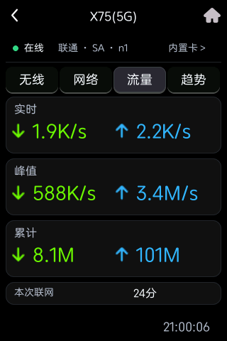 | 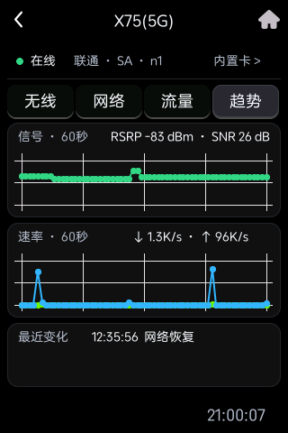 |

| X75 SIM 与模块 | V3E2 无线参数 |
| --- | --- |
| 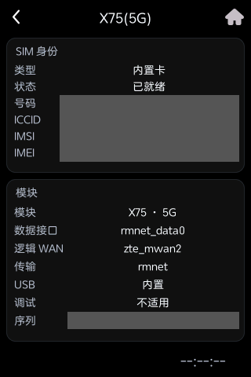 |  |

| V3E2 SIM 与模块 | V3E1 网络与承载 |
| --- | --- |
|  | 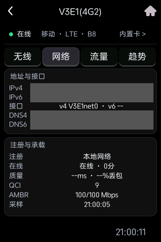 |

| V3E1 SIM 与模块 | Mihomo |
| --- | --- |
| 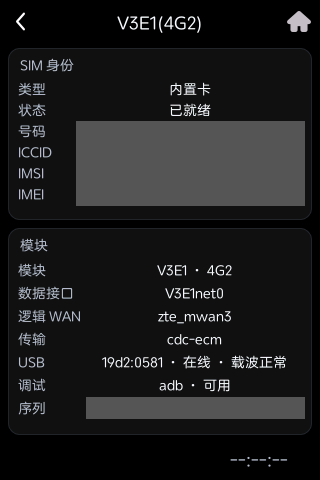 |  |

## 设备状态与控制

| 系统 | 全局流量 |
| --- | --- |
| 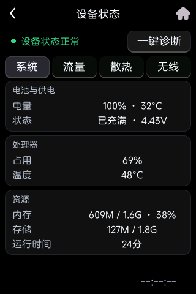 | 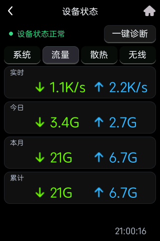 |

| 散热 | 风扇曲线 |
| --- | --- |
| 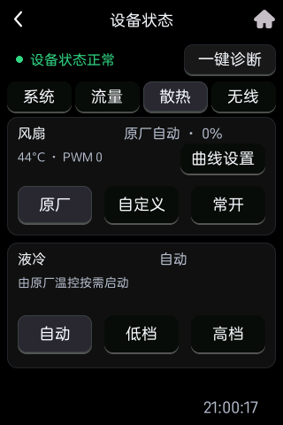 |  |

| Wi-Fi 功率 | 一键诊断 |
| --- | --- |
| 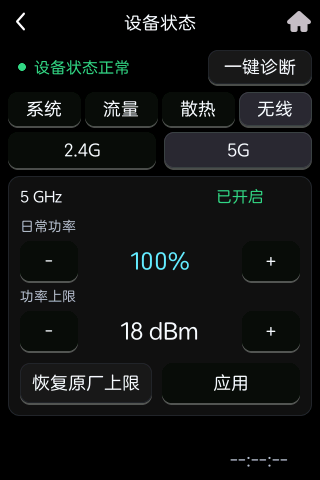 | 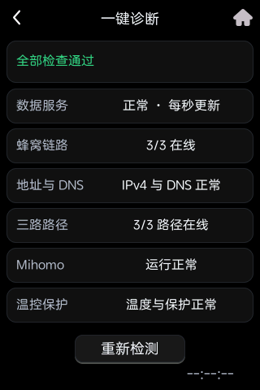 |
